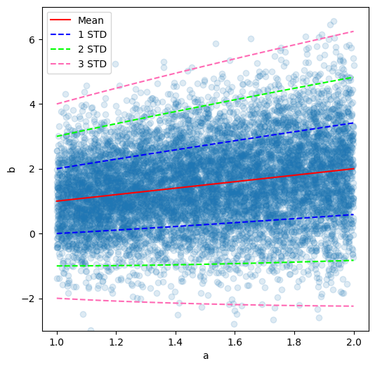
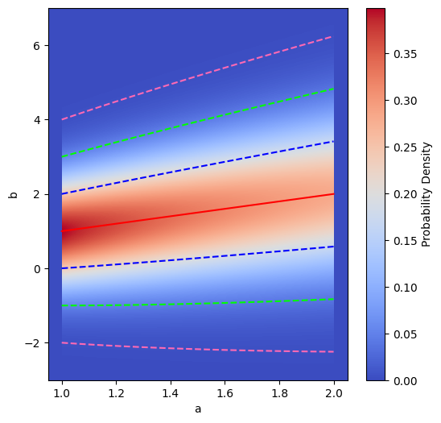
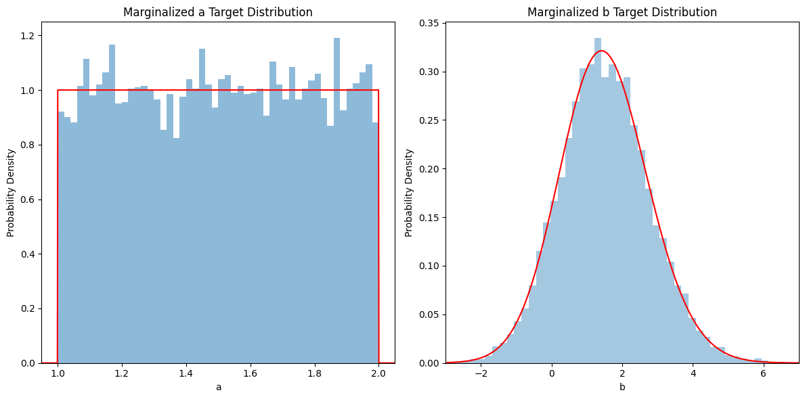
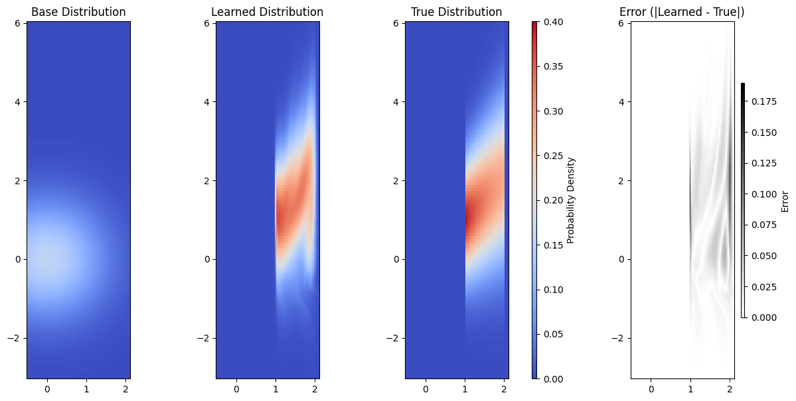
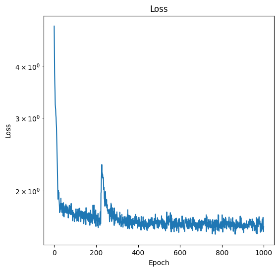
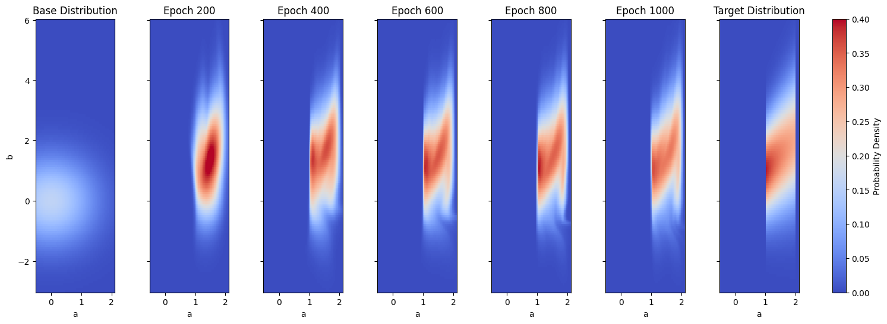
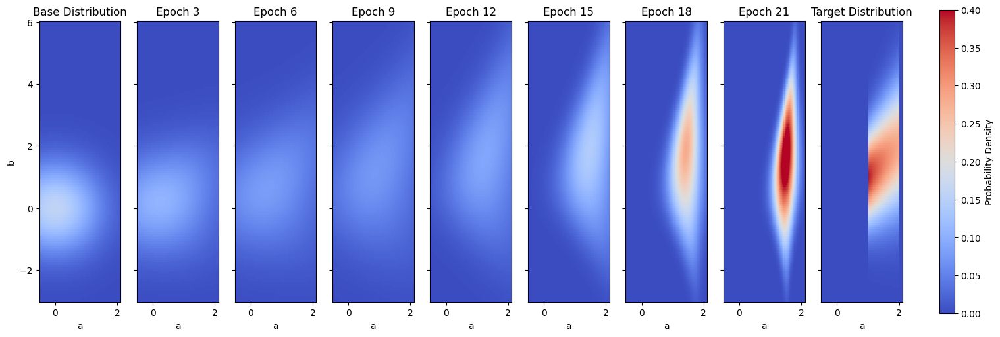
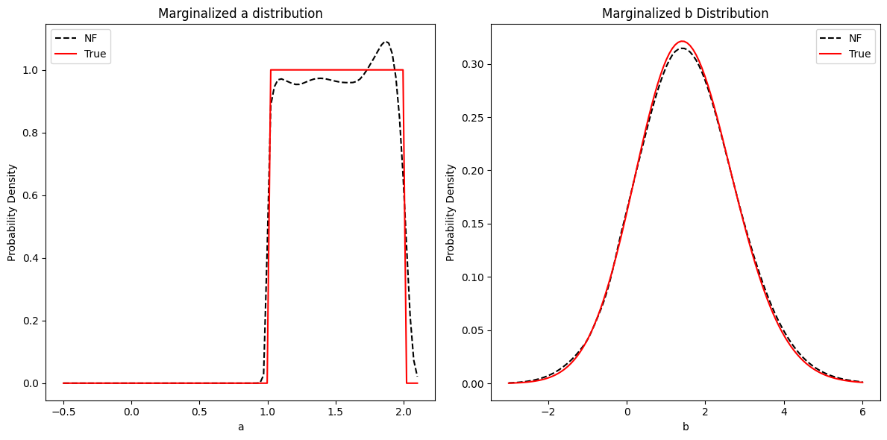
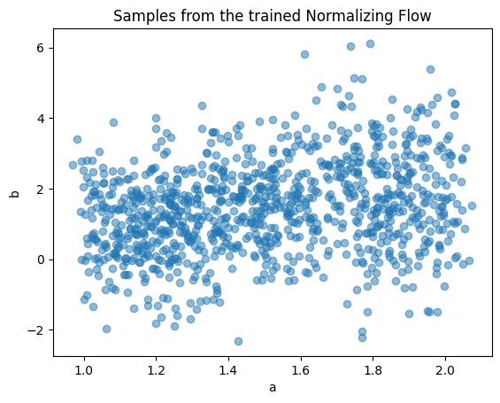

- [Tutorial](#tutorial)
- [Visualizing the target distribution](#visualizing-the-target-distribution)
- [Setting up the normalizing flow](#setting-up-the-normalizing-flow)
- [Training the normalizing flow](#training-the-normalizing-flow)
- [Sampling from the trained normalizing flow](#sampling-from-the-trained-normalizing-flow)
- [Acknowledgements](#acknowledgements)
- [Author](#author)


Normalizing flows can approximate complex probability distributions by applying a sequence of invertible transformations to a simpler base distribution, such as a multivariate Gaussian. If the base distribution has a joint probability density function (PDF) $p\left(\textbf{x}\right)$, the sequence for invertible transformations $f_1, f_2, ... f_k$ is applied to the original variable $\textbf{x}$ such that

$$\textbf{z} = f_k\left(f_{k-1}\left(...f_1\left(\textbf{x}\right)\right)\right) = g\left(\textbf{x}\right), $$

where $\textbf{z}$ is the transformed variable and $g\left(\textbf{x}\right)$ is the composition of all other transformations $f_i$. This flexible framework allows for the learning of complex probability distributions that might not be obtainable by other methods.

Additionally, we can see that one of the benefits of normalizing flows is efficient sampling of complex distributions. Samples can be easily calculated for the base distribution, such as a Gaussian, which then through the normalizing flow transform $g\left(\textbf{x}\right)$ provides samples from the learned distribution.

The transformed joint PDF $p\left(\textbf{z}\right)$ can be easily calculated from the trained normalizing flow. The normalization condition for a PDF dictates that, for both $p\left(\textbf{x}\right)$ and $p\left(\textbf{z}\right)$,

$$\int ... \int d x_1 ... d x_N \; p\left(\textbf{x}\right) = 1, \tag{1}$$

$$\int ... \int d z_1 ... d z_N \; p\left(\textbf{z}\right) = 1. $$

Because $\textbf{z} = g\left(\textbf{x}\right)$, the second integral can be expressed in terms of $x$ as 

$$
\begin{align}
    1 &= \int ... \int d z_1 ... d z_N \; p\left(\textbf{z}\right) \\
    &= \int ... \int d x_1 ... d x_N \left| \text{det} \frac{d \textbf{z}}{d \textbf{x}} \right| p\left(g\left(x\right)\right),
\end{align}\tag{2}
$$

where $\frac{d \textbf{z}}{d \textbf{x}}$ is the matrix of first derivatives whose determinant is the *Jacobian* of the transformation function $g$. With the correct assumptions about the integration domain, comparison of Equations 1 and 2 yield

$$p\left(\textbf{z}\right) = p\left(\textbf{x}\right) \left| \text{det} \frac{d \textbf{x}}{d \textbf{z}} \right|, $$

which can be easily calculated from the trained normalizing flow using automatic differentiation. See these resources [[1]](https://en.wikibooks.org/wiki/Probability/Transformation_of_Random_Variables) [[2]](https://stats.libretexts.org/Bookshelves/Probability_Theory/Probability_Mathematical_Statistics_and_Stochastic_Processes_(Siegrist)/03%3A_Distributions/3.07%3A_Transformations_of_Random_Variables) [[3]](https://en.wikipedia.org/wiki/Probability_density_function)
for more details about the transformation of random variables.

## Tutorial

This tutorial will demonstrate the use of the `normflows` Python package (see the `normalizing-flows` [Github repository](https://github.com/VincentStimper/normalizing-flows)) for a simple example using a normalizing flow to approximate an unknown target distribution. An IPython notebook containing the full code in this tutorial can be found [here](https://github.com/jayspendlove/blog/tree/main/simple-normalizing-flow). For this example, the 2D target distribution $p(a,b)$ will consist of a random variable $a$ sampled from a uniform distribution, and another random variable $b$ sampled from a Normal distribution with mean and variance $a$. 

$$ a \sim \text{Uniform}\left[1,2\right] $$
$$ b \sim \text{Normal}\left(\mu=a, \sigma^2=a\right). $$

Stated differently, we want the normalizing flow approximation $NF\left(a, b\right) \approx p\left(a,b\right)$. It is assumed that samples from the target distribution $p\left(a,b\right)$ can be easily obtained. 

This tutorial will begin by visualizing the target distribution $p\left(a,b\right)$, followed by construction and training of the normalizing flow on samples from $p\left(a,b\right)$. 


```python
import normflows as nf
import torch
import numpy as np
import matplotlib.pyplot as plt
```

## Visualizing the target distribution

To help us get an idea of what this target distribution $p\left(a,b\right)$ looks like, we will visualize it in a couple different ways. First, we'll draw $10000$ samples of pairs $\left(a,b\right)$ from the distributions defined in Equations 4 and 5 and visualize the resulting 2D scatter plot.


```python
N = 10000
sampled_a_vals = np.random.uniform(1, 2, N) # Uniform distribution
sampled_b_vals = np.random.normal(sampled_a_vals, np.sqrt(sampled_a_vals)) # Normal distribution with mean a and variance a
```
    
<!--  -->


We see that as expected, both the mean and the standard deviation of the $b$ distribution increase with increasing $a$. Note that the sampled points appear to have the highest density for low $a$. We can see the same thing by calculating the expected probability distribution $p\left(a,b\right)$ analytically, using the law of total probability.


```python
def p_a(a):
    """Probability density function of a ~ Uniform[1,2]. Trivial function in this case, but included for consistency."""
    return np.where((a >= 1) & (a <= 2), 1, 0)

def p_b_given_a(b, a):
    """Probability density function of b ~ Normal(a, a), p(b|a). 
    
    Args:
        b (np.ndarray): Values of b.
        a (np.ndarray): Values of a, mean and variance of b.
    """
    return (1 / (np.sqrt(2 * np.pi * a))) * np.exp(-0.5 * ((b - a)**2 / a))

def p_a_b(ab):
    """Joint probability density p(a, b).
    
    Args:
        ab (np.ndarray): 2D array where each row is a tuple (a, b).
    """
    a = ab[:, 0]
    b = ab[:, 1]
    return p_a(a) * p_b_given_a(b, a)
```

<!--  -->


In addition to visualizing the full 2D distribution, we can look at just the $a$ and $b$ target distributions by marginalizing out the other variable. Because $a$ does not depend on $b$, the marginalized distribution for $a$ is just the $p\left(a\right) \sim \text{Uniform}\left[1,2\right]$. The marginal $b$ distribution, however, is more challenging to obtain because it depends on $a$ in a non-trivial way. If you think about it, as $a$ increases from $1$ to $2$, the distribution for $b$ will drift and spread out, meaning that the total marginal distribution of $b$ is a combination of all these different Normal distributions for different values of $a$. The marginal distribution $p\left(b\right)$ can be calculated by

$$
p(b) = \int_1^2 da \frac{1}{\sqrt{2 \pi a}} \text{exp}\left(\frac{\left(b-a\right)^2}{2a}\right).
$$

This integral is challenging to solve analytically, but can be calculated straightforwardly via numerical integration. Below is shown the marginal distributions for $a$ and $b$.
    
<!--  -->


## Setting up the normalizing flow

Now that we understand our target distributions, we can begin to set up our normalizing flow to approximate $p(a,b)$.

Here, we use the `normflows` Python package which utilizes Pytorch. Setting up a normalizing flow includes deciding on the number and type of flow layers and the base distribution. The base distribution is the initial choice of probability density, which the normalizing flow will transform over the course of training. These choices are problem specific. 


```python
# Define NF architecture
torch.manual_seed(0)
K = 16 # number of repeated blocks
latent_size = 2 # num input channels
flows = []
for i in range(K):
    param_map = nf.nets.MLP([1, 64, 64, 2], init_zeros=True)
    flows += [nf.flows.AffineCouplingBlock(param_map)]
    flows += [nf.flows.LULinearPermute(latent_size)]

base = nf.distributions.DiagGaussian(2, trainable=False) # Base distribution
model = nf.NormalizingFlow(q0=base, flows=flows)
```

## Training the normalizing flow

The next step is to train the normalizing flow on samples of $(a,b)$ from the true distributions. Here the loss function is chosen to be the negative log likelihood. Using the Adam optimizer, the normalizing flow is trained for 1000 epochs, with 512 samples of the true distribution per epoch.

```python
# Train NF
epochs = 1000
num_samples = 2 ** 9 # 512 samples per iteration
optimizer = torch.optim.Adam(model.parameters(), lr=1e-3, weight_decay=1e-5)

for it in range(epochs):
    optimizer.zero_grad()
    x = sample_ab(num_samples, device) # Get training samples
    loss = -1*model.log_prob(x).mean() # Compute loss
    # Do backprop and optimizer step
    if ~(torch.isnan(loss) | torch.isinf(loss)): # Check for NaNs or infs
        loss.backward()
        optimizer.step()
    save_info(it, model, loss)
```

Following training, we can see that in a small number of iterations the normalizing flow learned distribution was able to effectively capture the primary features of the target distribution. The error plot on the right shows where the true and learned distributions disagree.

    
<!--  -->

    


To get an idea of how quickly the normalizing flow converged to this approximation, we can look at the training loss over epochs. We see that the loss for the normalizing flow solution has plateaued by the end of training. In fact, even if we train for 10x as long the learned distribution does not improve significantly.


```python
# Plot loss
plt.figure(figsize=(6, 6))
plt.plot(loss_hist, label='loss')
plt.title('Loss')
plt.xlabel('Epoch')
plt.ylabel('Loss')
plt.yscale('log')
plt.show()
```


    
<!--  -->


By looking at probability densities at intermediate epochs, we can see that the approximate normalizing flow solution achieves reasonable accuracy early in training.

    
<!--  -->


From the loss function, we see that the largest changes happen at the very beginning of training. In the subplots below, by looking at some of the first few epochs we can see the probability density migrating from the original Gaussian centered at $(0,0)$ towards the region with the target density.
    
<!--  -->

    


As another perspective of the normalizing flow solution, we can look at the marginalized probability densities for $a$ and $b$ and compare the true and approximate solutions, in red and black respectively.

    
<!--  -->


## Sampling from the trained normalizing flow

Once the normalizing flow has been trained, sampling from it is trivial.


```python
model.eval() #Set model to evaluation mode
samples, log_prob = model.sample(num_samples=1000) #Sample from normalizing flow
```

    
<!--  -->

    


## Acknowledgements

Some of the code in this tutorial was adapted from example scripts in the `normalizing-flows` repository: https://github.com/VincentStimper/normalizing-flows

Stimper et al., (2023). normflows: A PyTorch Package for Normalizing Flows. Journal of Open Source Software, 8(86), 5361, https://doi.org/10.21105/joss.05361

## Author
Jay Spendlove

PhD student, Arizona State University

jcspendl@asu.edu
